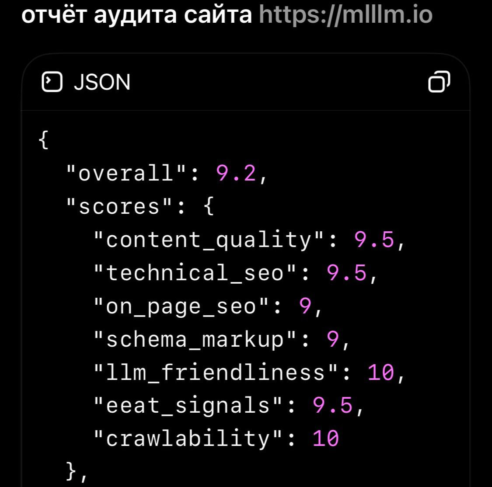

# SEO/LLM Skill Cluster

[](https://github.com/sergekostenchuk/seo-llm-skill-cluster/actions/workflows/validate.yml)


This repository contains a staged Codex skill cluster for building, auditing, and improving websites that need to work well for people, search engines, and LLM agents.

The cluster grew out of work on [mlllm.io](https://mlllm.io), a personal AI news and builder-lab site by Sergey Kostenchuk. The site was created as a public profile and evidence surface while preparing an OpenAI open-source grant application, and it became a practical test case for sending AI news from [lookatainews on Telegram](https://t.me/lookatainews) into a public website with clean SEO, structured data, and LLM-readable discovery files.

After two intense days of iteration with several models, the useful pattern became clear: this should not be one large SEO prompt. It should be a coordinated group of skills with an orchestrator, specialists, validators, test artifacts, and a task plan that keeps the work auditable.

## Quick Start

Clone the repository and run the local validation checks:

```bash
git clone https://github.com/sergekostenchuk/seo-llm-skill-cluster.git
cd seo-llm-skill-cluster

python3 plans/seo-llm-skill-cluster/scripts/lint_skill_cluster.py . \
  --report .reports/seo-llm-cluster-lint.json

python3 plans/seo-llm-skill-cluster/scripts/verify_mvp_evals.py . \
  --report .reports/seo-llm-mvp-evals.json

for f in skills/*/evals.json; do
  python3 -m json.tool "$f" >/dev/null
done
```

Then inspect:

- [examples/mlllm-case-study](examples/mlllm-case-study/) for sample outputs;
- [plans/seo-llm-skill-cluster/TASK-PLAN.md](plans/seo-llm-skill-cluster/TASK-PLAN.md) for the full task-plan history;
- [plans/seo-llm-skill-cluster/final-validation-report.md](plans/seo-llm-skill-cluster/final-validation-report.md) for the validation snapshot.

## What The Skills Produce

| Skill | Main output |
| --- | --- |
| `site-growth-orchestrator` | Handoff packet, routing decisions, task sequencing |
| `semantic-core-architect` | Query, intent, entity, topic, and language map |
| `information-architecture-seo` | URL model, section map, canonical/hreflang rules |
| `internal-link-graph-architect` | Brief-longform-topic-project link graph |
| `technical-seo-schema-engineer` | Metadata, schema.org, sitemap, RSS, robots, `llms.txt` audit |
| `llm-friendly-site-architect` | Agent-readable discovery model, source trail, answer block guidance |
| `seo-regression-validator` | Static SEO regression reports for public pages |
| `editorial-quality-gate` | Editorial QA checklist and content improvement report |
| `ux-journey-architect` | Reader journeys, onboarding gaps, retention path recommendations |
| `server-log-crawler-analyst` | Crawler access and bot behavior reports |
| `llm-citation-monitor` | Prompt matrix and citation evidence report |
| `external-authority-placement-scout` | Dry-run authority opportunity register |
| `backlink-quality-validator` | White-hat backlink risk and quality report |

## Example Output

The mlllm.io case study includes real example artifacts:

- [goal brief](examples/mlllm-case-study/goal-brief.md)
- [routing and handoffs](examples/mlllm-case-study/routing-and-handoffs.md)
- [semantic core](examples/mlllm-case-study/semantic-core.md)
- [URL map](examples/mlllm-case-study/url-map.md)
- [internal link graph](examples/mlllm-case-study/internal-link-graph.md)
- [technical SEO/schema audit](examples/mlllm-case-study/technical-seo-schema-audit.md)
- [LLM-friendly audit](examples/mlllm-case-study/llm-friendly-audit.md)
- [improvement backlog](examples/mlllm-case-study/improvement-backlog.md)
- JSON regression reports for homepage, news, article, and site access checks.

## mlllm.io Case Study



This image is an example audit snapshot from the mlllm.io case study. It is a model-assisted audit result, not a formal third-party certification. The useful part is not the number by itself, but the workflow behind it: structured metadata, schema, `llms.txt`, public discovery files, source trails, internal linking, and validation artifacts.

Read the case study: [docs/mlllm-case-study.md](docs/mlllm-case-study.md).

## Why This Exists

Modern public sites need more than classic SEO:

- humans need clear navigation, trust signals, and a readable content model;
- search engines need metadata, canonical URLs, hreflang, sitemap coverage, and schema;
- LLM agents need crawlable HTML, `llms.txt`, source trails, entity pages, and stable linking;
- operators need evidence from tests, logs, crawler behavior, and live audits instead of guesses.

The goal of this cluster is to turn that combined work into repeatable skills.

## Task-Plan Driven Work

The work was managed with [task-plan-v2-dashboard](https://github.com/sergekostenchuk/task-plan-v2-dashboard).

That dashboard matters because multi-step agent work quickly becomes hard to supervise from chat alone. A task plan with visible status, blockers, validation, and handoff notes gives the user room to stop watching every model turn and at least make a cup of coffee while the agent continues through a controlled checklist.

The task plan in this repository is not decoration. It is the control document for scope, sequencing, tests, safety boundaries, and publication hygiene.

## Cluster Shape

The central orchestrator is:

- `site-growth-orchestrator`

Core SEO/LLM skills:

- `semantic-core-architect`
- `information-architecture-seo`
- `internal-link-graph-architect`
- `technical-seo-schema-engineer`
- `llm-friendly-site-architect`
- `seo-regression-validator`

Companion skills:

- `editorial-quality-gate`
- `ux-journey-architect`
- `server-log-crawler-analyst`
- `llm-citation-monitor`
- `external-authority-placement-scout`
- `backlink-quality-validator`

## Safety Boundaries

This cluster is intentionally evidence-first and white-hat:

- no hidden bot-only content;
- no duplicate content factories;
- no fake rankings, citations, or crawler claims;
- no link farms, PBNs, spam comments, fake reviews, or doorway pages;
- no external posting, outreach, PRs, DMs, or submissions without explicit authorization;
- schema must match visible user-facing content;
- monitoring reports must distinguish observed facts, inferences, and open questions.

Authority placement skills are dry-run by default. They can scout and validate opportunities, but real-world posting requires approval and platform-specific rules.

## Repository Layout

```text
skills/
  site-growth-orchestrator/
  semantic-core-architect/
  information-architecture-seo/
  internal-link-graph-architect/
  technical-seo-schema-engineer/
  llm-friendly-site-architect/
  seo-regression-validator/
  editorial-quality-gate/
  ux-journey-architect/
  server-log-crawler-analyst/
  llm-citation-monitor/
  external-authority-placement-scout/
  backlink-quality-validator/

examples/
  mlllm-case-study/

docs/
  mlllm-case-study.md

plans/seo-llm-skill-cluster/
  TASK-PLAN.md
  FEATURE-PREPARATION.md
  cluster-architecture.md
  validation-matrix.md
  final-validation-report.md
  scripts/
  evals/

wiki/
  seo-llm-skill-cluster.md
```

## Validation

The staged cluster includes JSON eval files, validation reports, a cluster linter, an MVP eval verifier, and a GitHub Actions workflow.

CI runs on push and pull request:

- JSON syntax validation;
- YAML syntax validation;
- skill-cluster linter;
- MVP eval verifier;
- public package sensitive-pattern scan.

## Status

This is a staged skill workspace, not an automatic production install.

Use it as:

- a reference implementation for a skill cluster;
- a reusable SEO/LLM site architecture playbook;
- a task-plan example for multi-agent website optimization;
- a starting point for controlled local Codex skill installation.

Before installing these skills into a live Codex skills directory, review the trigger map, run validation, and keep backups of any existing skills with overlapping names.
