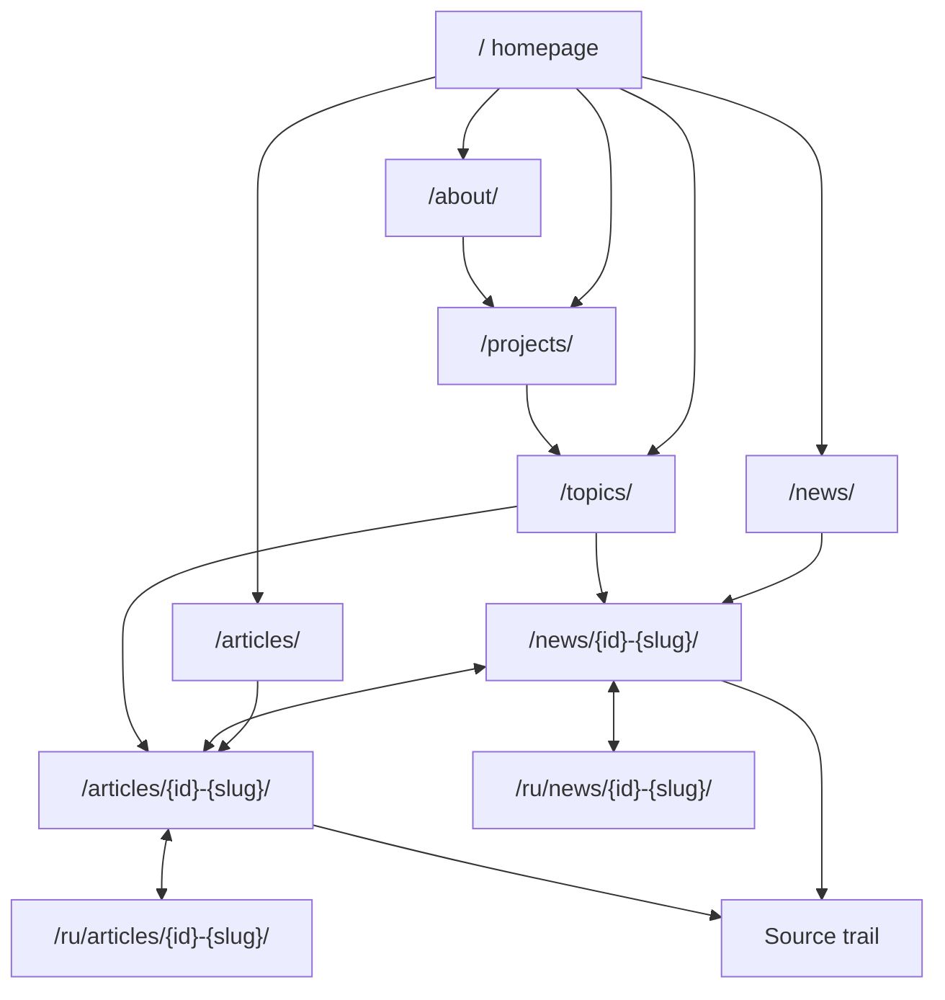

# Internal Link Graph

task: T-019
target: `https://mlllm.io`

## Intended Graph

## Link Rules

- Homepage cards may link to brief, longform, and language alternates.
- Brief pages should link to the matching longform as the deeper read.
- Longform pages should link back to the matching brief as the short summary.
- EN/RU alternates should be visible and also represented in `hreflang`.
- Topic pages should route to collections and examples, not duplicate the full article body.
- Project pages should explain why a project matters and link to related topics or posts.

## Observed From Regression Reports

- Audited homepage exposes `CollectionPage`, `Organization`, `Person`, and `WebSite` schema.
- Audited EN brief exposes `NewsArticle` and `BreadcrumbList`.
- Audited EN longform exposes `TechArticle` and `BreadcrumbList`.
- Audited pages include `en`, `ru`, and `x-default` hreflang values.

## Open Checks

- Full crawl orphan detection across all 1451 sitemap URLs was not run in this E2E.
- Browser visual link verification was not run in this E2E.
- Anchor text distribution was not measured.
