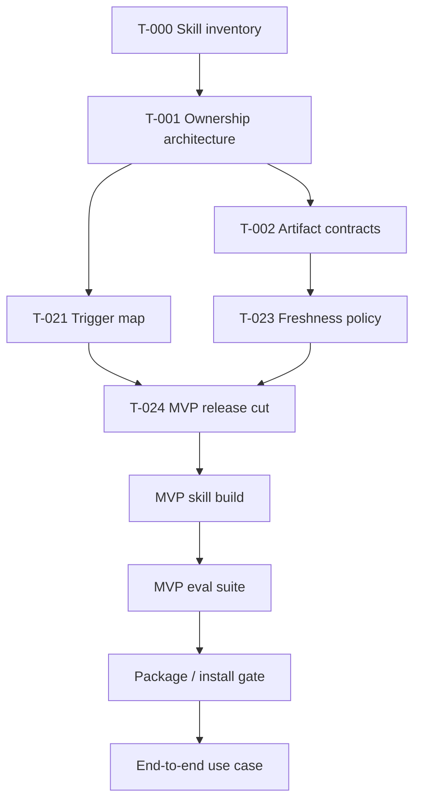

# SEO/LLM Skill Cluster Architecture

plan_id: PLAN-SEO-LLM-SKILL-CLUSTER
task_id: T-001
date: 2026-06-11
status: complete

## Target Path Decision

Development and validation path:

```text
./skills/<skill-name>/
```

Production install path, gated until packaging/validation:

```text
<codex-skills-dir>/<skill-name>/
```

Decision:

- Build new or upgraded skills in `./skills`.
- Do not edit installed production skills during MVP implementation.
- Install, copy, or symlink into `<codex-skills-dir>` only during T-017 after validation, packaging, rollback instructions, and user approval.
- Existing installed skills remain read-only inputs unless a later task explicitly upgrades them.

This resolves `A-PATH-001` for implementation planning while preserving a production install gate.

## Cluster Ownership Matrix

| Domain | Owner skill | Path decision | Owns | Does not own | Handoff |
|---|---|---|---|---|---|
| Orchestration | `site-growth-orchestrator` | new in `./skills/site-growth-orchestrator` | Intake, sequencing, task-plan handoff prompts, artifact checklist, escalation. | Detailed SEO, schema, UX, security, link placement implementation. | Routes to specialist skill and records evidence requirements. |
| Task-plan governance | existing `ta<api-key-redacted>` | reuse installed skill | TASK-PLAN v2 structure, pre-implementation gates, alarms, task status policy. | Site-growth domain expertise. | Consumed by `site-growth-orchestrator`; not replaced. |
| Skill production quality | existing `senior-skill-architect` | reuse installed skill | Skill architecture, references/scripts/assets, trigger descriptions, evals, linting, packaging quality. | SEO/UX domain decisions. | Reviews every production skill before install. |
| Core SEO/LLM architecture | `seo-llm-static-site-architect` or upgraded `seo-llm-site-architect` | build MVP wrapper/staging skill first; production upgrade later only if approved | Entity/intent map, URL/canonical/hreflang, robots/sitemap/llms.txt, schema policy, public crawlability. | UX layout polish, security hardening, external posting. | Receives semantic core and produces URL/schema/discovery artifacts. |
| Semantic core | `semantic-core-architect` | new narrow staging skill or reference under SEO architecture | Query intents, entity clusters, language priorities, source evidence labels. | URL routing or page implementation. | Feeds information architecture and content planning. |
| Technical SEO validation | `seo-regression-validator` | new narrow staging skill | Deterministic live/static checks: title/meta/canonical/hreflang/schema/sitemap/robots/llms/rss. | Strategic site architecture or content rewriting. | Consumes SEO artifacts and reports pass/fail evidence. |
| LLM citation/content layer | existing `llm-friendly-site-optimizer` | reuse/upgrade later | `llms.txt`, pillar pages, direct answers, TL;DR, FAQ when visible, topic matrices, assistant citation monitoring. | Canonical URL policy, security controls, hidden bot-only content. | Uses SEO architecture outputs and visible content rules. |
| UX and user journeys | existing `ui-ux-llm-product-architect` | reuse installed skill | Journeys, onboarding, layout, accessibility, semantic UI controls, rendered checks. | Search schema, crawler policy, authority placement. | Reviews public page experience after SEO/content structure. |
| Design intelligence | existing `ui-ux-pro-max` | optional helper | Palette, typography, component/design-system reference. | Product journey ownership. | Used only when visual system decisions are needed. |
| Security and privacy | existing `web-security-architect` | reuse installed skill | Auth, private/public boundaries, headers, CSP/CORS, logs, secrets, bot-abuse risk, AI-agent safety. | Ranking/citation strategy. | Safety gate for crawler access, analytics/logs, and external placement. |
| Browser verification | existing `agent-browser-codex` | reuse installed skill | Browser interaction, screenshots, rendered UI smoke checks. | SEO/UX judgment. | Called when validators need rendered evidence. |
| Wiki sync | existing `wiki-update` / `llm-wiki-maintainer` | reuse installed skills | Obsidian wiki sync, project knowledge distillation, vault contract. | Skill architecture or SEO decisions. | Runs after implemented skills are validated. |
| External authority | future `external-authority-placement-scout` | post-MVP new skill | White-hat opportunity discovery, platform relevance, approval-ready outreach drafts. | Automated spam/posting, toxic links, hidden placement. | Requires security/safety review and user approval. |
| Backlink quality | future `backlink-quality-validator` | post-MVP new skill | Relevance, indexability, nofollow/sponsored, toxicity, canonical target, monitoring tags. | Outreach writing or posting. | Validates scout proposals before user action. |
| Credentialed monitoring | future `search-console-analyst`, `rank-serp-monitor`, `server-log-crawler-analyst` | post-MVP, source-dependent | Search Console/rank/log evidence, bot classification, citation/ranking reality. | Claims without timestamped evidence. | Requires freshness policy and credential/data boundaries. |

## Dependency Graph



## Handoff Order

1. `site-growth-orchestrator` receives the site/project goal and creates a task-plan handoff.
2. `semantic-core-architect` or SEO architecture skill defines entities, intents, languages, and evidence.
3. SEO architecture skill maps canonical URLs, page roles, hreflang, and indexability.
4. LLM optimizer adds answer-shaped visible content, `llms.txt`, pillar/topic guidance, and citation monitoring requirements.
5. UX architect checks human journeys, onboarding, accessibility, and rendered readability.
6. Security architect checks private/public boundaries, bot access safety, analytics/log privacy, and external-placement risk.
7. Regression validator runs live/static checks and emits evidence.
8. Senior skill architect validates skill packaging, trigger descriptions, evals, and production readiness.
9. Wiki/update layer records stable decisions and artifacts after validation.

## Orchestrator Authority Boundary

`site-growth-orchestrator` may:

- classify the request;
- choose the next specialist;
- prepare handoff prompts;
- require artifacts and evidence;
- stop the workflow when safety, freshness, or trigger ownership is unclear;
- maintain a high-level progress checklist.

`site-growth-orchestrator` must not:

- silently replace specialist skills;
- implement detailed schema, UX, security, or link-placement logic itself;
- claim to programmatically invoke skills;
- bypass TASK-PLAN governance;
- invent live SEO, crawler, assistant-citation, ranking, or backlink evidence.

## Safety Decisions

- External placement is post-MVP and always dry-run first.
- No skill may generate hidden SEO-only content or schema that does not match visible content.
- Credentialed data sources stay out of skill artifacts unless access policy and secret handling are explicit.
- Raw IP logs and private analytics rows are not copied into public plans, wiki pages, or eval fixtures.
- Current crawler names, Google/Search Central rules, schema.org expectations, platform policies, and AI-search behavior must follow the freshness policy from T-023.

## T-001 Review Result

- `A-PATH-001` is resolved by choosing `./skills` as the staging path and keeping `.codex/skills` as a gated production install target.
- No cycle is present in the dependency graph.
- Broad ownership overlaps are assigned to one primary owner with handoff rules.
- New skill creation is limited to narrow MVP gaps and staging paths.
